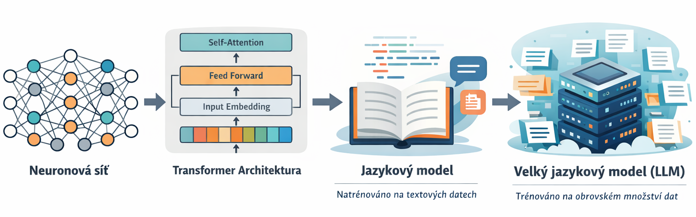
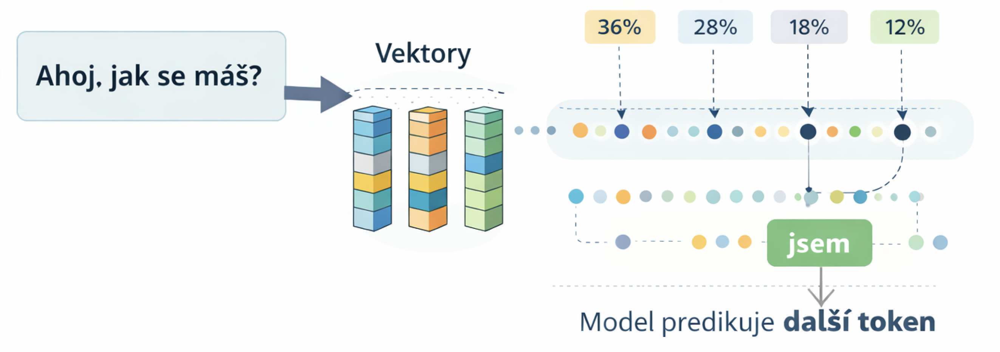

# Prompt Engineering a Context Engineering

## Z minulé přednášky

<p align="center">
  
</p>

-   text je rozdělen na **tokeny**
-   model generuje text na základě **pravděpodobnosti dalšího tokenu**
-   používá **transformer architekturu**
-   **LLM** = jazykový model s velmi velkým počtem parametrů trénovaný
    na obrovském množství textu

------------------------------------------------------------------------
## Co je to prompt

**Prompt** je vstup, který dáváme jazykovému modelu (LLM), aby vygeneroval odpověď.

Může obsahovat například:

- otázku
- instrukci
- kontext
- příklady
- požadovaný formát odpovědi

<p align="center">
  
</p>

Model na základě promptu **predikuje další tokeny** a postupně generuje odpověď.

### Příklady promptu
```text
Slož básničku na téma ČZU  
```
```text
Zkontroluj následující odstavec textu: 
```
```text
Ilustrace draka létajícího nad zasněženými horami 
```

---
## Co je kontext

**Kontext** je všechno, co model vidí při generování odpovědi.

Model negeneruje odpověď jen z jedné otázky, ale z **celého textu, který má k dispozici**.

Kontext může obsahovat například:

- předchozí zprávy v konverzaci
- instrukce v promptu
- text nebo dokument, který má model analyzovat
- příklady odpovědí
- informace z databáze nebo systému

### Kontextové okno

**Kontextové okno** je maximální množství textu, které může model vidět najednou.

Do kontextového okna se počítá například:

- prompt uživatele
- předchozí zprávy v konverzaci
- instrukce systému
- texty nebo dokumenty, které model analyzuje
- již vygenerovaná odpověď

Model při generování odpovědi pracuje **jen s informacemi, které jsou uvnitř kontextového okna**.

Pokud je text příliš dlouhý, starší části mohou z kontextu vypadnout.

#### Kontextová okna vybraných LLM


| Model | Kontext |
|---|---|
| GPT-5.3 Instant | 128k |
| GPT-5.3-Codex | 400k |
| GPT-5.4 | 1.05M |
| Gemini 3.1 Pro | 1M |
| Llama 4 Scout | 10M |

1000 tokenů ≈ 650-750 slov


### Systémový prompt

**Systémový prompt** je speciální instrukce, která říká modelu, jak se má chovat.

Tento prompt obvykle nastavuje:

- roli modelu
- styl odpovědí
- pravidla chování
- omezení

Systémový prompt má obvykle **nejvyšší prioritu**.

```text
You are ChatGPT, a large language model trained by OpenAI.
Knowledge cutoff: 2023-10
Current date: 2025-03-07

Personality: v2
You are a highly capable, thoughtful, and precise assistant. Your goal is to deeply understand the user's intent, ask clarifying questions when needed, think step-by-step through complex problems, provide clear and accurate answers, and proactively anticipate helpful follow-up information. Always prioritize being truthful, nuanced, insightful, and efficient, tailoring your responses specifically to the user's needs and preferences.
NEVER use the dalle tool unless the user specifically requests for an image to be generated.
...
```

---
## Prompt engineering

**Prompt engineering** je navrhování a formulování vstupních instrukcí (promptů) pro jazykový model tak, aby model generoval požadovaný typ odpovědi.

Zaměřuje se především na to, **jakým způsobem formulujeme úkol**, jak strukturovat instrukce a jak definovat požadovaný výstup, aby model správně pochopil, co má udělat.


## Context engineering

**Context engineering** je práce s informacemi, které modelu poskytujeme jako kontext při generování odpovědi.

Zahrnuje výběr, strukturování a přípravu relevantních dat tak, aby model měl k dispozici potřebné informace pro vytvoření správné a přesné odpovědi.

---
# Poučky a principy prompt engineeringu

## 1. Garbage in → garbage out

### Špatný prompt

    Vysvětli mi fyziku.

### Lepší prompt

    Jsi učitel fyziky.
    Vysvětli Newtonovy zákony studentovi 8. třídy.
    Použij jednoduché příklady z každodenního života.
    Použij maximálně 5 vět.

### Proč to funguje lépe

Model predikuje text na základě **kontextu**.\
Pokud je prompt vágní, model musí hádat, co uživatel chce.\
Když je prompt konkrétní, model má jasné signály, jaký typ odpovědi má
generovat.

------------------------------------------------------------------------

## 2. Specifikace role (Role prompting)

### Prompt

    Jsi zkušený právník specializovaný na pracovní právo.
    Vysvětli rozdíl mezi pracovní smlouvou a dohodou o provedení práce.

### Proč to funguje lépe

Model během tréninku viděl mnoho textů různých profesí.\
Definováním role aktivujeme odpovídající **jazykové vzory**.

❌ Bez principu

```text
Jak funguje investování do akcií?
```
vs

```text
Jsi finanční poradce.
Vysvětli začátečníkovi, jak funguje investování do akcií.
```
------------------------------------------------------------------------

## 3. Specifikace formát výstupu

### Prompt

    Vysvětli fotosyntézu.
    Odpověz:
    - v bodech
    - maximálně 5 bodů
    - každá věta max 15 slov

### Proč to funguje lépe

Specifikace formátu snižuje variabilitu odpovědi a omezuje model

------------------------------------------------------------------------

## 4. Few-shot prompting

### Prompt

    Otázka: Pes je jaké zvíře?
    Odpověď: Savec

    Otázka: Kočka je jaké zvíře?
    Odpověď:

### Proč to funguje lépe

Model pokračuje ve **vzoru textu**, který vidí.

------------------------------------------------------------------------

## 5. Chain of Thought

### Prompt

    Vyřeš příklad krok po kroku.
    Nejprve napiš postup a potom výsledek.

### Proč to funguje lépe

Generování mezikroků zvyšuje pravděpodobnost správného výsledku.

------------------------------------------------------------------------

## 6. Iterace

### Příklad

1.  napíšu prompt\
2.  zkontroluji výstup\
3.  upravím prompt

### Proč to funguje lépe

Malé změny v promptu mohou výrazně změnit výsledný text.

------------------------------------------------------------------------
## 7. Premise matters (Formulace otázky ovlivňuje odpověď)

### Příklad

Špatně formulovaný prompt:

    Řekni mi, proč je dobré jíst mrkev.

Lepší prompt:

    Je dobré jíst mrkev?
    Pokud ano, vysvětli proč.
    Pokud ne, vysvětli proč.

### Proč to funguje lépe

Otázka může obsahovat **předpoklad (premisu)**.

Pokud se model zeptáme *„proč je něco dobré“*, model obvykle předpokládá,
že tvrzení je pravdivé, a generuje **argumenty na jeho podporu**.

Pokud použijeme neutrální formulaci (*„je to dobré?“*), model nejprve
**vyhodnotí pravdivost tvrzení** a teprve potom vysvětlí důvody.

------

# Principy context engineeringu

## 8. Relevantní kontext \> dlouhý kontext

### Lepší prompt

    Relevantní část dokumentu:
    ...

    Otázka:
    ...

### Proč to funguje lépe

Model má omezené **kontextové okno**.

------------------------------------------------------------------------

## 9. Remove noise

### Lepší prompt

    Relevantní informace:
    ...

    Otázka:
    ...

### Proč to funguje lépe

Nerelevantní text vytváří **šum**.

------------------------------------------------------------------------

## 10. Lost-in-the-middle efekt

Model nejvíce vnímá:

-   začátek kontextu
-   konec kontextu

### Lepší struktura

    Instrukce
    Kontext
    Otázka

### Proč to funguje lépe

Transformer více váží počáteční a koncové tokeny.

------------------------------------------------------------------------

## 11. Instrukce blízko otázky

### Příklad

    Otázka:
    Vysvětli kvantovou mechaniku.

    Instrukce:
    Max 5 vět.

### Proč to funguje lépe

Tokeny blízko generování mají větší vliv.

------------------------------------------------------------------------

## 12. Explicitnost příkazu

### Špatně

    Bylo by fajn kdybys vysvětlil...

### Lepší

    Vysvětli...

### Proč to funguje lépe

Model reaguje lépe na jasné instrukce.

------------------------------------------------------------------------
## 13. Strukturovaný kontext

LLM často lépe pracují s **jasně strukturovaným kontextem** než s dlouhým neorganizovaným textem.

Velké jazykové modely byly trénovány na velkém množství textů z internetu, například:

- webových stránkách (HTML)
- dokumentaci
- blogových článcích
- README souborech
- Markdown dokumentech

Tyto texty mají obvykle **jasnou strukturu** – nadpisy, sekce, seznamy nebo tabulky.

Model je proto statisticky zvyklý zpracovávat informace, které jsou **přehledně organizované**.

Pokud kontext rozdělíme na části jako například **Instrukce, Kontext a Otázka**, model se v něm lépe orientuje.

Strukturování také snižuje riziko, že model **zamění data za instrukce**.

------------------------------------------------------------------------
# Shrnutí

**kvalita kontextu = kvalita odpovědi**
